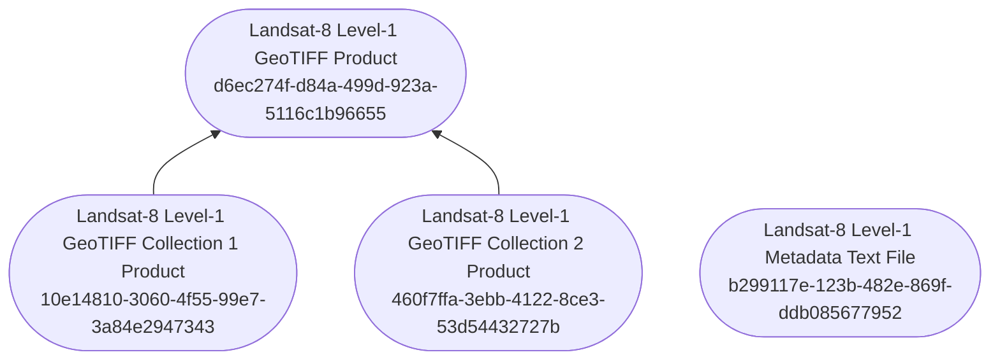

# DRB Topic Landsat 8
Topic plugin for DRB Python, this project define
[Landsat8](https://www.usgs.gov/landsat-missions/landsat-8) data.

More details about DRB: https://drb-python.gitlab.io/drb/user/what_is_drb.html

## Installation
``` shell
pip install drb-topic-landsat8
```

## Landsat 8 topics

