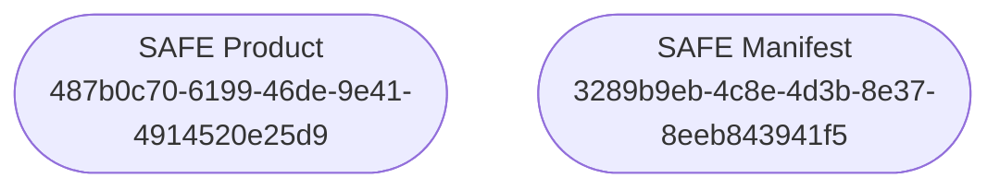

# drb-topic-safe
The DRB plugin `drb-topic-safe` declare topics about *Standard Archive Format 
for Europe* ([**SAFE**](https://sentinels.copernicus.eu/web/sentinel/user-guides/sentinel-1-sar/data-formats/safe-specification))
format specification.


## Installation
```
pip install drb-topic-safe
```

## Topics
This section references topics defined in `drb-topic-safe`.



